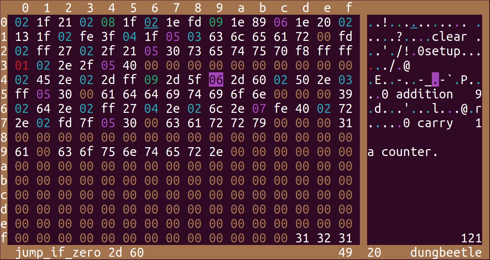

# dungbeetle

A tiny toy VM that consists of 256 bytes of memory and a cursor.

The memory is used to store variables and instructions, document the code, and place the output.
There is no separate mode for running programs.

Given the minimalist nature of the project, it's in no way fit for productive work.
But it's fun.

## getting started

1. Install Zig.
2. Run `zig build run -- intro.dung`

## why?

I created this project as an exercise to learn Zig and tinker with terminal UIs.
